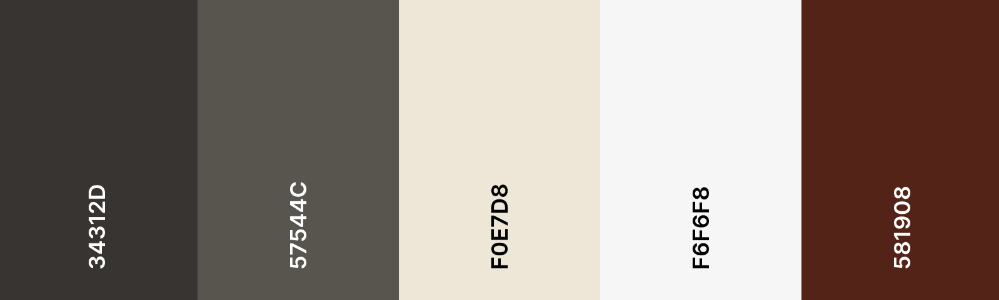
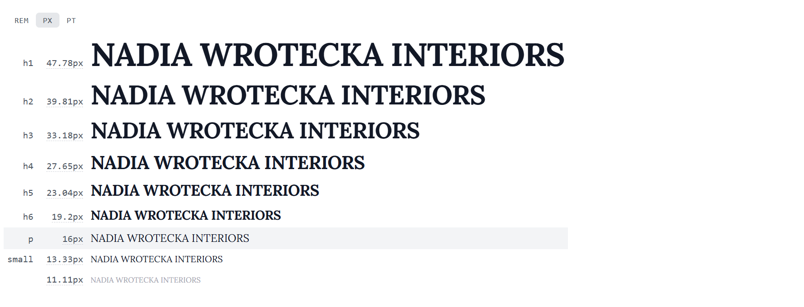
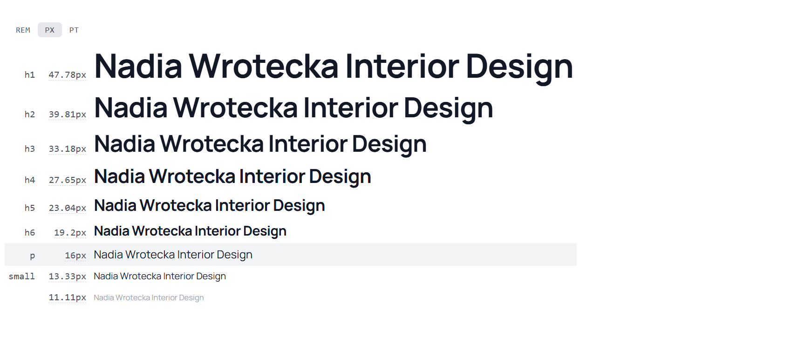

# [Nadia Wrotecka Interiors](https://sadghoblin.github.io/nw-interiors-m1)

Developer: Matt McCarthy ([SADGHOBLIN](https://www.github.com/SADGHOBLIN))

**Nadia Wrotecka Interiors** is a responsive portfolio website primarily built with HTML, CSS, and Bootstrap, with the purpose of **creating an accessible and engaging online presence for a client**, who offers residential interior design services to their customers.

The target audience of this website is **potential freelance clients**, and also **prospecting employers**, looking to engage with the designer's work through their portfolio.

This project hopes to accomplish a **higher rate of interest** from the target audience, **increasing the designer's client base** or **employment prospects**.

The site will serve as a **central hub** that invites visitors to **learn about the designer's background**, **explore her design work**, and easily be able to **contact her for inquiries**.

I chose this project as my partner is a freelance interior designer with a genuine need for an online presence for her business. Taking on a project with **real world value** for someone important to me provides me the opportunity to challenge myself and push my skills.

source: [nw-interiors-m1 amiresponsive](https://ui.dev/amiresponsive?url=https://sadghoblin.github.io/nw-interiors-m1)

## UX

### The 5 Planes of UX

#### 1. Strategy

**Purpose**:
- Establish an online presence for the designer, reflecting her work and personality in an engaging way.
- Increase the visibility of the designer's work and creative identity.
- Develop a platform that showcases her skills and can be easily accessed across multiple devices.

**Primary User Needs**:
- Learn about the designer and her background.
- View their creative work, and explore their projects.

**Business Goals**:
- Generate legitimate interest in the designer's services.
- Increase freelance client base, and employment prospects.

#### 2. Scope

**Features**:
- (see a breakdown here: [Features](#features))

**Content Requirements**:
- Striking header that clearly informs the visitor of the site's purpose.
- High quality images that illustrate the designer's skills.
- Section that provides more information where the user can learn about the designer.
- Form which can be used to get in touch with the designer about her services.
- Responsive website that works seamlessly across devices.

#### 3. Structure

**Information Architecture**:
- **Navigation Menu**:
  - Accessible links in the navbar.
- **Hierarchy**:
  - Clear call-to-action buttons.
  - Prominent placement of social media links in the footer.

**User Flow**:
1. User lands on the home page → learns about the designer's style through a large featured image.
2. Navigates to the about section → understands about their background and experience.
3. Views their portfolio of work → engages with links to learn more about specific projects.
4. Contacts the designer through the contact form, inquiring about their services or work.
5. Further engages with the designer on her social media platforms.

#### 4. Skeleton

**Wireframes**:
- (see illustrations here: [Wireframes](#wireframes))

#### 5. Surface

**Visual Design Elements**:
- **[Colours](#colour-scheme)** (see below)
- **[Typography](#typography)** (see below)

### Colour Scheme

I used [coolors.co](https://coolors.co/34312d-57544c-f0e7d8-f6f6f8-581908) to generate my color palette.

- `#34312D` Jet - primary text.
- `#57544C` Walnut Brown - secondary text.
- `#F0E7D8` Antique White - primary background / highlights.
- `#F6F6F8` Anti-flash White - secondary backgorund / highlights.
- `#581908` Seal Brown - main accent.

 

The rationale behind this colour scheme was determined by the brief: the main purpose behind the site is to showcase the designer's work in its best light. Therefore, choosing a neutral and balanced colour palette that compliments the designer's work was crucial.

I chose some warm off whites for the background, complimented with some warm blacks for the text. These neutral tones compliment the sample of images that I have been provided with by the client, and the seal brown accent colour helps tie in the portfolio images with the rest of the site, allowing for a cohesive design.

### Typography

I sourced my fonts from both **Google Fonts** and **Adobe Fonts**, and used **FontPair** to find an effective font pairing. A combination of a serif font with a sans-serif font was used to create a gentle contrast between the title and body elements. The serif font, **Lora**, was used to give the portfolio a curated feel to reflect the personality of the website, and the designer.

To reflect the designer's creative identity, **FontAwesome** icons were integrated as visual cues, reinforcing the site's emphasis on clarity and visual design.

- [Lora](https://fonts.adobe.com/fonts/lora) was used for the primary headers and titles, taken from [Adobe Fonts](https://fonts.adobe.com/fonts).

- [Manrope](https://fonts.google.com/specimen/Manrope) was used for all other body text, taken from [Google Fonts](https://fonts.google.com/).

- [FontPair](https://www.fontpair.co/pairings/manrope-lora) was used to find a cohesive set of fonts that compliment one another.
- [Font Awesome](https://fontawesome.com) icons were used throughout the site, such as the social media icons in the footer.