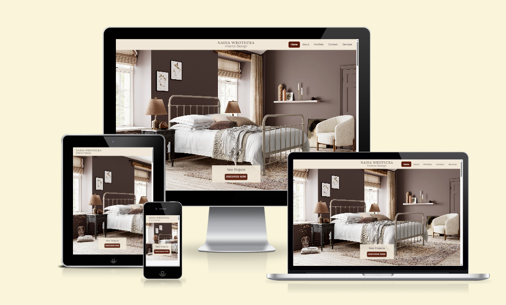

# [Nadia Wrotecka Interiors](https://sadghoblin.github.io/nw-interiors-m1)

Developer: Matt McCarthy ([SADGHOBLIN](https://www.github.com/SADGHOBLIN))

**Nadia Wrotecka Interiors** is a responsive portfolio website primarily built with HTML, CSS, and Bootstrap, with the purpose of **creating an accessible and engaging online presence for a client**, who offers residential interior design services to their customers.

The target audience of this website is **potential freelance clients**, and also **prospecting employers**, looking to engage with the designer's work through their portfolio.

This project hopes to accomplish a **higher rate of interest** from the target audience, **increasing the designer's client base** or **employment prospects**.

The site will serve as a **central hub** that invites visitors to **learn about the designer's background**, **explore her design work**, and easily be able to **contact her for inquiries**.

I chose this project as my partner is a freelance interior designer with a genuine need for an online presence for her business. Taking on a project with **real world value** for someone important to me provides me the opportunity to challenge myself and push my skills.

source: [nw-interiors-m1 amiresponsive](https://ui.dev/amiresponsive?url=https://sadghoblin.github.io/nw-interiors-m1)

## UX
### The 5 Planes of UX
#### 1. Strategy
#### 2. Scope
#### 3. Structure
#### 4. Skeleton
#### 5. Surface