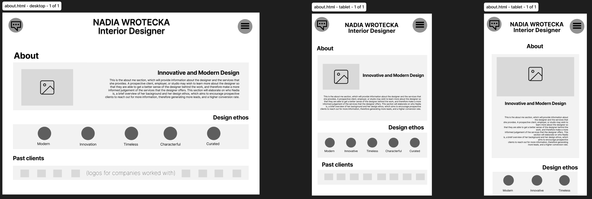

# [Nadia Wrotecka Interiors](https://sadghoblin.github.io/nw-interiors-m1)

Developer: Matt McCarthy ([SADGHOBLIN](https://www.github.com/SADGHOBLIN))

**Nadia Wrotecka Interiors** is a responsive portfolio website primarily built with HTML, CSS, and Bootstrap, with the purpose of **creating an accessible and engaging online presence for a client**, who offers residential interior design services to their customers.

The target audience of this website is **potential freelance clients**, and also **prospecting employers**, looking to engage with the designer's work through their portfolio.

This project hopes to accomplish a **higher rate of interest** from the target audience, **increasing the designer's client base** or **employment prospects**.

The site will serve as a **central hub** that invites visitors to **learn about the designer's background**, **explore her design work**, and easily be able to **contact her for inquiries**.

I chose this project as my partner is a freelance interior designer with a genuine need for an online presence for her business. Taking on a project with **real world value** for someone important to me provides me the opportunity to challenge myself and push my skills.

source: [nw-interiors-m1 amiresponsive](https://ui.dev/amiresponsive?url=https://sadghoblin.github.io/nw-interiors-m1)

## UX

### The 5 Planes of UX

#### 1. Strategy

**Purpose**:
- Establish an online presence for the designer, reflecting her work and personality in an engaging way.
- Increase the visibility of the designer's work and creative identity.
- Develop a platform that showcases her skills and can be easily accessed across multiple devices.

**Primary User Needs**:
- Learn about the designer and her background.
- View their creative work, and explore their projects.

**Business Goals**:
- Generate legitimate interest in the designer's services.
- Increase freelance client base, and employment prospects.

#### 2. Scope

**Features**:
- (see a breakdown here: [Features](#features))

**Content Requirements**:
- Striking header that clearly informs the visitor of the site's purpose.
- High quality images that illustrate the designer's skills.
- Section that provides more information where the user can learn about the designer.
- Form which can be used to get in touch with the designer about her services.
- Responsive website that works seamlessly across devices.

#### 3. Structure

**Information Architecture**:
- **Navigation Menu**:
  - Accessible links in the navbar.
- **Hierarchy**:
  - Clear call-to-action buttons.
  - Prominent placement of social media links in the footer.

**User Flow**:
1. User lands on the home page → learns about the designer's style through a large featured image.
2. Navigates to the about section → understands about their background and experience.
3. Views their portfolio of work → engages with links to learn more about specific projects.
4. Contacts the designer through the contact form, inquiring about their services or work.
5. Further engages with the designer on her social media platforms.

#### 4. Skeleton

**Wireframes**:
- (see illustrations here: [Wireframes](#wireframes))

#### 5. Surface

**Visual Design Elements**:
- **[Colours](#colour-scheme)** (see below)
- **[Typography](#typography)** (see below)

### Colour Scheme

I used [coolors.co](https://coolors.co/34312d-57544c-f0e7d8-f6f6f8-581908) to generate my color palette.

- `#34312D` Jet - primary text.
- `#57544C` Walnut Brown - secondary text.
- `#F0E7D8` Antique White - primary background / highlights.
- `#F6F6F8` Anti-flash White - secondary backgorund / highlights.
- `#581908` Seal Brown - main accent.

 

The rationale behind this colour scheme was determined by the brief: the main purpose behind the site is to showcase the designer's work in its best light. Therefore, choosing a neutral and balanced colour palette that compliments the designer's work was crucial.

I chose some warm off whites for the background, complimented with some warm blacks for the text. These neutral tones compliment the sample of images that I have been provided with by the client, and the seal brown accent colour helps tie in the portfolio images with the rest of the site, allowing for a cohesive design.

### Typography

I sourced my fonts from both **Google Fonts** and **Adobe Fonts**, and used **FontPair** to find an effective font pairing. A combination of a serif font with a sans-serif font was used to create a gentle contrast between the title and body elements. The serif font, **Lora**, was used to give the portfolio a curated feel to reflect the personality of the website, and the designer.

To reflect the designer's creative identity, **FontAwesome** icons were integrated as visual cues, reinforcing the site's emphasis on clarity and visual design.

- [Lora](https://fonts.adobe.com/fonts/lora) was used for the primary headers and titles, taken from [Adobe Fonts](https://fonts.adobe.com/fonts).

- [Manrope](https://fonts.google.com/specimen/Manrope) was used for all other body text, taken from [Google Fonts](https://fonts.google.com/).

- [FontPair](https://www.fontpair.co/pairings/manrope-lora) was used to find a cohesive set of fonts that compliment one another.
- [Font Awesome](https://fontawesome.com) icons were used throughout the site, such as the social media icons in the footer.

## Wireframes

To follow best practice, wireframes were developed for mobile, tablet, and desktop sizes.
[Figma](https://www.figma.com/) was used to design the wireframes for this site. The full file can be viewed [here](https://www.figma.com/design/5wzjNNIanay33PBcxIJdiu/nw-interiors-wireframes?node-id=0-1&t=3WIsrVRLXakJtyCU-1).

| Page | Wireframe - desktop, tablet, mobile |
| --- | --- |
| Home section |  |
| About section |  |
| Portfolio section |  |
| Footer section |  |
| Services page |  |
| Projects page |  |

## User Stories

A list of user stories can be found on the [Project Board](https://github.com/users/SADGHOBLIN/projects/3/views/1) that was used to track development progress, using [MoSCoW Prioritisation](#moscow-prioritsation).

More information regarding the [Agile Development Process](#agile-development-process) that was used for this project can be found later in the document.

### User Friendly Website Navigation with Responsive Design (Must have)
**User story**:
As a first-time visitor, I want to be able to navigate fluidly through the website and find relevant information quickly. It should be easy to understand how to use the website, what its purpose is, and should be appropriately optimised for my device.

**Acceptance criteria**:
- Intuitive navigation with easy access to relevant information for the user.
- Fully responsive website across various devices and screen sizes.
- Clearly illustrate the website's purpose on first visit with a layout that prominently features the main content.

**Tasks**:
- Utilise Bootstrap or media queries to ensure the website responds to different screen sizes and is accessible on all common devices.
- Ensure information layout and site structure is arranged appropriately so that the user can find key information quickly, with a navbar that is always accessible to improve the user experience.
- Design a header section that clearly demonstrates that this is an Interior Designer's website where visitors can view their work.
---
### About Me Section (Must have)
**User story**:
As a prospective employer or client, I want to be able to learn more about the designer, their background, location, skills, and their ethos so that I can determine whether they would be a good fit for me.

**Acceptance criteria**:
- Website features an about me section that provides some background information on the designer.
- About me section is easily accessible, and laid out clearly so information is easily digestible.
- Contains relevant information to visitors, such as location, background, education, skills, and design ethos.

**Tasks**:
- Design an engaging about me section that injects some of the designer's personality and contains all the relevant information about them and their background.
- Ensure the section is easily accessible, and information is displayed clearly.
---
### Portfolio Gallery of Images (Must have)
**User story**:
As a prospective employer or studio, I need clear access to the designer's body of work. The images should be presented clearly and be high quality, so that the work can be analysed closely to determine whether their work is suitable for employment.

**Acceptance criteria**:
- Website has a portfolio section that clearly displays high quality images of the designer's work in an uncluttered manner.
- Portfolio utilises either Bootstrap grid of CSS grid to create an engaging layout that is responsive to all devices.
Images contain a description that lists which project the image is from, and link to that project if appropriate.

**Tasks**:
- Create a responsive portfolio section featuring images of the designer's work, with the image's corresponding relevant information.
- Integrate high quality images that are optimised for web.
---
### Contact Form for Inquiries (Must have)
**User story**:
As an interested client, I want to be able to get in touch with the designer or book an appointment if I am interested in their services, so that I can inquire as to whether they are available. I would like if there were multiple ways to contact the designer, and multiple ways for them to contact me.

**Acceptance criteria**:
- Website features a clear means of contacting the designer, so that users know that they can get in touch with the designer easily.
- Contains a contact form for inquiries and bookings, and what services they are interested in.

**Tasks**:
- Create an inquiry form with fields for the user's name, contact information, and an input field for their message.
- Form should confirm user input through a page that shows their form submission was successful.
---
### Contact Section with Social Media Links (Should have)
**User story**:
As an interested client or customer, I need to be able to easily contact the designer so that I can inquire about their services, ask questions, or connect with them via social media platforms.

**Acceptance criteria**:
- Website contains a dedicated section for contact information, email, and other available platforms to connect with the designer.
- Section should be clearly visible and accessible from all parts of the website, with clickable links that take you to the appropriate platform.

**Tasks**:
- Create a section for contact information, utilising information provided from the client such as email, location, phone number, and social media platforms.
- Ensure the section is easily accessible from all parts of the website, adhering to common design principles.
---
### Success Page and Input Confirmation (Should have)
**User story**:
As an interested client, I want to receive feedback from my user inputs so that I know that the designer has received my information. There should be a page letting me know that my information has been successfully inputted into the contact form.

**Acceptance criteria**:
- Website displays a page to confirm user inputs have been successful when submitting a form, or something similar.
- The success page should let me easily navigate back to the main website page.

**Tasks**:
- Create a page for a successful form submission that clearly indicate that my information has been successfully received.
- Ensure these pages allow the user to return to the main home page through a button for a fluid user experience.
---
### 404 Page (Could have)
**User story**:
As a website visitor, I want to informed of an errors that prevent me from navigate the website, so that I know that the problem isn't due to my own fault. I would like it to redirect me back to the main webpage so that I can try again.

**Acceptance criteria**:
- Website features a 404 page that is displayed if any errors occur.
- The page should redirect me back to the homepage for a fluid user experience.

**Tasks**:
- Create a separate 404 page that clearly informs the user than a problem has occurred with their request/action.
- Allow the user to easily navigate back to the homepage through a button, so that the interruption for the user is minimal.

## Features
| Feature | Notes | Screenshot |
| --- | --- | --- |
| Navbar | Featured on all three pages, the fully responsive navigation bar includes links to the Home section, About section, Portfolio section, and Contact section, and is identical in each page to allow for easy navigation. On smaller screens, a burger icon is used to toggle the navbar so it doesn't take up too much space. This section will allow the user to easily navigate from page to page or section to section across all devices without having to revert back to the previous page via the "back" button. |  |
| Hero Image | The landing includes a photo that immediately conveys the designer's style, which fills the screen and adapts the image composition based on the screen size of the device. A call to action is overlayed on top of the image, encouraging exploration, with an animated down arrow to demonstrate to users which action to take. |  |
| About section | This section provides a background of the designer where the user can learn more about the designer's experience and education. It contains a tagline that summarises what the designer and site is about in just a few words, allowing the user to grasp the purpose of the site quickly. A list of keywords, illustrated with icons, also further elaborate on the designer's style and personality. This provides background information to the reader in various formats, suitable for skim-reading, or detailed exploration, depending on the user. |  |
| Portfolio section | The main portfolio gallery is the heart of the site. Adaptive to the device screen size so there is no stretching or skewing, it utilises as much of the space as possible to display the designer's work. Each project has a hero image, with further details about the project listed below, including a link that opens the project in a new tab. The portfolio projects change their order, and image, to respond to different screen widths in order to capture the project in the most effective and engaging format. On mobile devices, vertical images are used, and some of these change to landscape images on larger screen widths in order to most effectively make use of the user's device. |   |
| Contact form | Users are able to get in touch with the designer through the contact form, requiring them to input their Name, Email, Inquiry type, and Message into the form in order to submit. Optionally, they can also add their phone numnber to the form, which uses a regex forumula to allow the user to include their area code. On mobile devices, the supporting image is hidden in order to keep the user's focus completely on entering their details, whilst on larger screens, an image sits alongside the form in order to utilise the deadspace whilst keeping the form to a suitable size for the user. |  |
| Footer | The footer sits below the contact form and includes links to the relevant social media sites for *Nadia Wrotecka Interiors*. The links will open in a new tab to allow easy navigation for the user. The footer is valuable to the user, as it encourages them to keep connected via social media, whilst also providing more contact information about the business. A link to the developer's GitHub is also included, which opens ina  new tab, should the user wish to find out more about the design of the site. |  |
| Success page | The confirmation page will give the illusion that the contact form was submitted successfully to the *Nadia Wrotecka Interiors*, confirming their input. Due to the lack of a database or email system so far, this is a fake confirmation page, and the user can navigate back to the main site through the navbar or button. |  |
| 404 page | The 404 error page will indicate when a user has somehow navigated to a page that doesn't exist. This replaces the default GitHub Pages 404 page, and ties-in with the look and feel of the *Nadia Wrotecka Interiors* site by using the standard navbar and footer. |  |
