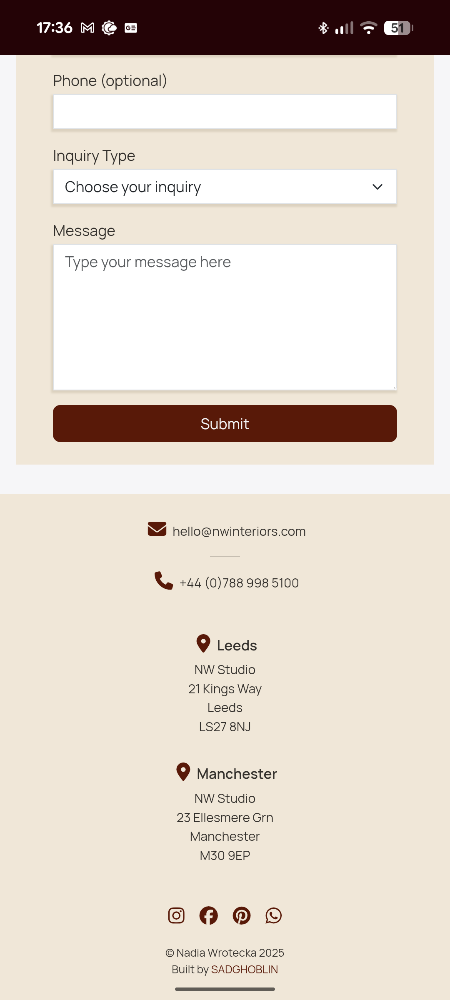

# Testing

> [!NOTE]  
> Return back to the [README.md](README.md) file.

## Code Validation

### HTML

I have used the recommended [HTML W3C Validator](https://validator.w3.org) to validate all of my HTML files.

| Directory | File | URL | Screenshot | Notes |
| --- | --- | --- | --- | --- |
| root | [404.html](https://github.com/SADGHOBLIN/nw-interiors-m1/blob/main/404.html) | [HTML Validator](https://validator.w3.org/nu/?doc=https://sadghoblin.github.io/nw-interiors-m1/404.html) |  | No warnings / errors |
| root | [index.html](https://github.com/SADGHOBLIN/nw-interiors-m1/blob/main/index.html) | [HTML Validator](https://validator.w3.org/nu/?doc=https://sadghoblin.github.io/nw-interiors-m1/index.html) |  | No warnings / errors |
| root | [success.html](https://github.com/SADGHOBLIN/nw-interiors-m1/blob/main/success.html) | [HTML Validator](https://validator.w3.org/nu/?doc=https://sadghoblin.github.io/nw-interiors-m1/success.html) |  | No warnings / errors |

### CSS

I have used the recommended [CSS Jigsaw Validator](https://jigsaw.w3.org/css-validator) to validate all of my CSS files.

| Directory | File | URL | Screenshot | Notes |
| --- | --- | --- | --- | --- |
| assets/css | [styles.css](https://github.com/SADGHOBLIN/nw-interiors-m1/blob/main/assets/css/styles.css) | [CSS Validator](https://jigsaw.w3.org/css-validator/validator?uri=https://sadghoblin.github.io/nw-interiors-m1) |  | No errors, and warnings only relate to external libraries |

### JavaScript

I have used the recommended [JShint Validator](https://jshint.com) to validate all of my JS files.

| Directory | File | URL | Screenshot | Notes |
| --- | --- | --- | --- | --- |
| assets/js | [script.js](https://github.com/SADGHOBLIN/nw-interiors-m1/blob/main/assets/js/script.js) | n/a |  | No warnings / errors |

## Responsiveness

I've tested my deployed project to check for responsiveness issues across mobile, tablet, and desktop on the suitable devices. There were no major issues found and everything works as intended.

| Page | Mobile | Tablet | Desktop | Notes |
| --- | --- | --- | --- | --- |
| Home |  |  |  | Works as expected |
| About |  |  |  | Works as expected |
| Portfolio |  |   |   | Works as expected |
| Contact |  |  |  | Works as expected |
| Footer |  |  |  | Works as expected |
| Success |  |  |  | Works as expected |
| 404 |  |  |  | Works as expected |

## Browser Compatibility

I've tested my deployed project on multiple browsers to check for compatibility issues. There are no known issues, and site also behave responsively as expected.

| Page | Chrome | Firefox | Edge | Notes |
| --- | --- | --- | --- | --- |
| Home |  |  |  | Works as expected |
| About |  |  |  | Works as expected |
| Portfolio |   |   |   | Works as expected |
| Contact (w/ Footer) |  |  |  | Works as expected |
| Success |  |  |  | Works as expected |
| 404 |  |  |  | Works as expected |

## Lighthouse Audit

I've tested my deployed project using the Lighthouse Audit tool to check for any major issues. Some warnings are outside of my control, and mobile results tend to be lower than desktop.

The performance results for the main index page are acceptable, as the lower scores are a result of the image sizes. Since this is a portfolio website, it is necessary for the images to be of high quality, and therefore it is acceptable to sacrifice the load time at the expense of ensuring the images are crisp. They have been reduced and converted to webp to optimise them as much as possible.

| Page | Mobile | Desktop |
| --- | --- | --- |
| index |  |  |
| success |  |  |
| 404 |  |  |