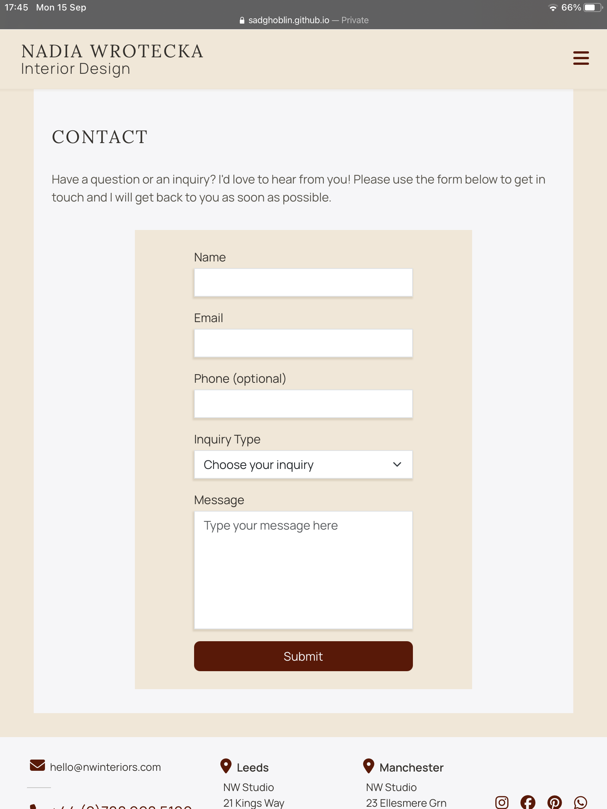
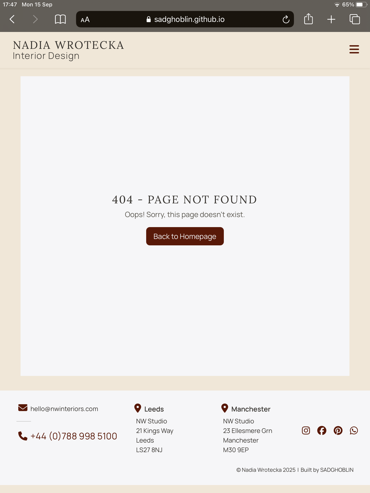
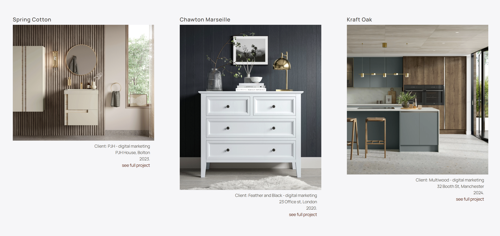
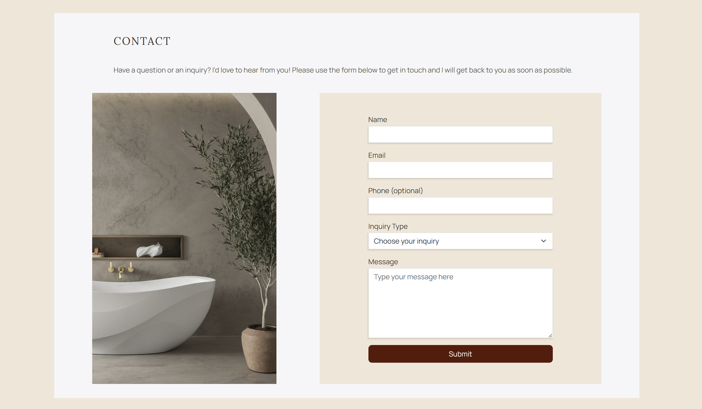
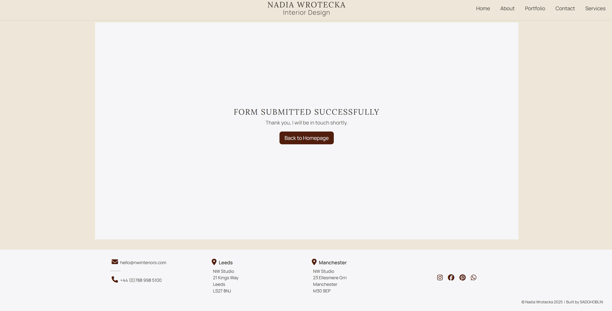

# Testing

> [!NOTE]  
> Return back to the [README.md](README.md) file.

## Code Validation

### HTML

I have used the recommended [HTML W3C Validator](https://validator.w3.org) to validate all of my HTML files.

| Directory | File | URL | Screenshot | Notes |
| --- | --- | --- | --- | --- |
| root | [404.html](https://github.com/SADGHOBLIN/nw-interiors-m1/blob/main/404.html) | [HTML Validator](https://validator.w3.org/nu/?doc=https://sadghoblin.github.io/nw-interiors-m1/404.html) |  | No warnings / errors |
| root | [index.html](https://github.com/SADGHOBLIN/nw-interiors-m1/blob/main/index.html) | [HTML Validator](https://validator.w3.org/nu/?doc=https://sadghoblin.github.io/nw-interiors-m1/index.html) |  | No warnings / errors |
| root | [success.html](https://github.com/SADGHOBLIN/nw-interiors-m1/blob/main/success.html) | [HTML Validator](https://validator.w3.org/nu/?doc=https://sadghoblin.github.io/nw-interiors-m1/success.html) |  | No warnings / errors |

### CSS

I have used the recommended [CSS Jigsaw Validator](https://jigsaw.w3.org/css-validator) to validate all of my CSS files.

| Directory | File | URL | Screenshot | Notes |
| --- | --- | --- | --- | --- |
| assets/css | [styles.css](https://github.com/SADGHOBLIN/nw-interiors-m1/blob/main/assets/css/styles.css) | [CSS Validator](https://jigsaw.w3.org/css-validator/validator?uri=https://sadghoblin.github.io/nw-interiors-m1) |  | No errors, and warnings only relate to external libraries |

### JavaScript

I have used the recommended [JShint Validator](https://jshint.com) to validate all of my JS files.

| Directory | File | URL | Screenshot | Notes |
| --- | --- | --- | --- | --- |
| assets/js | [script.js](https://github.com/SADGHOBLIN/nw-interiors-m1/blob/main/assets/js/script.js) | n/a |  | No warnings / errors |

## Responsiveness

I've tested my deployed project to check for responsiveness issues across mobile, tablet, and desktop on the suitable devices. There were no major issues found and everything works as intended.

| Page | Mobile | Tablet | Desktop | Notes |
| --- | --- | --- | --- | --- |
| Home |  |  |  | Works as expected |
| About |  |  |  | Works as expected |
| Portfolio |  |   |   | Works as expected |
| Contact |  |  |  | Works as expected |
| Footer |  |  |  | Works as expected |
| Success |  |  |  | Works as expected |
| 404 |  |  |  | Works as expected |

## Browser Compatibility

I've tested my deployed project on multiple browsers to check for compatibility issues. There are no known issues, and site also behave responsively as expected.

| Page | Chrome | Firefox | Edge | Notes |
| --- | --- | --- | --- | --- |
| Home |  |  |  | Works as expected |
| About |  |  |  | Works as expected |
| Portfolio |   |   |   | Works as expected |
| Contact (w/ Footer) |  |  |  | Works as expected |
| Success |  |  |  | Works as expected |
| 404 |  |  |  | Works as expected |

## Lighthouse Audit

Upon performing audits, I realised that I had not converted two images from `.jpg` to `.webP`. I proceeded to convert these images to `.webP` before re-running the audit tests.

I've tested my deployed project using the Lighthouse Audit tool to check for any major issues. Some warnings are outside of my control, and mobile results tend to be lower than desktop.

The performance results for the main index page are acceptable, as the lower scores are a result of the image sizes. Since this is a portfolio website, it is necessary for the images to be of high quality, and therefore it is acceptable to sacrifice the load time at the expense of ensuring the images are crisp. They have been reduced and converted to webp to optimise them as much as possible.

| Page | Mobile | Desktop |
| --- | --- | --- |
| index |  |  |
| success |  |  |
| 404 |  |  |

## Defensive Programming

Defensive programming was manually tested with the below user acceptance testing:

| Page / Feature | Expectation | Test | Result | Screenshot |
| --- | --- |  --- |  --- |  --- |
| Navbar | Feature is expected to have working and accessible navigation links. | Checked navigation links for functionality and accessibility. | Links are accessible, fully functional, and direct user to expected section. |   |
| Home | Site is expected to be fully responsive. | Resized the browser window and tested on multiple devices, and browsers. See [Responsiveness](#responsiveness) and [Browser Compatibility](#browser-compatibility) for details. | The site is responsive across all tested screen sizes. | See [Responsiveness](#responsiveness) and [Browser Compatibility](#browser-compatibility). |
| Hero | Hero landing page is expected to clearly demonstrate the purpose of the site, and encourage further user exploration whilst illustrating the designer's style. Scroll arrow is expected to take user to the next section upon clicking. | Tested that hovering over hero image reveals a scroll-down arrow, and contains a call to action button to emphasise suggested user action. Test scroll arrow functionality. | Hero image loads appropriately and responsiveness still captures a striking image across screen sizes. Scroll arrow animation works as expected, moving the user to the next section. |    |
| Call to Action | Feature is expected to encourage user navigation to the site's main portfolio content, inline with the site's primary purpose. | Test CTA button is visible, accessible, and navigates to the intended section. | Button works as intended and takes the user to the portfolio section. |   |
| About | Section is expected to clearly inform the user about the designer's professional background and experience. | Confirmed that the page has an accessible about section with concise information that is laid out effectively. | About details are displayed as expected, with multiple information formats (Large tagline, informative paragraphs, visual icons with keywords) to appeal to multiple user types of the designer's background and style. |  |
| Portfolio | Section is expected to display high quality images of the designer's work. Images should be fully responsive across all screen sizes and be optimised for the specific device that the user is viewing on. | Test across screen sizes to ensure the appropriate images are replaced with suitable sized alternatives. | Images are fully responsive, and behave as expected. The layout adapts to device to optimise the space on the screen, replacing the images where appropriate. |   |
| Portfolio Links | In the portfolio section, each project should contain project information with clickable links to navigate the user to the client's site in a new tab. | Tested all links to ensure they open the url in a new tab and function as expected. | Links are clear and accessible, clearly indicating to users their purpose. They work as expected, opening client websites in a new tab. |   |
| Contact Form | Form is expected to not let the user submit an empty form. | Attempted to submit a blank form. | Form submission attempt was blocked as expected, and encouraged user to input information. |  |
|  | Form is expected to enforce valid input types for the required fields. | Entered invalid data (e.g., random text in an email field, numbers in a name field, etc.). | Error messages were displayed appropriately, and submission was blocked. |     |
|  | Form is expected to allow the user to submit their form without entering a phone number, as this is optional. | Tested submiting a valid form with the number field empty. | Form submission was accepted, and user is taken to the success page to indicate a successful form submission. |   |
| Social Links | Feature is expected to include working links to the appropriate social platforms (Instagram, Facebook, etc.). | Clicked each social link to verify redirection to the correct platform page. | All links redirected to the correct platform pages, opening in new browser tabs. |      |
| 404 Error Page | Feature is expected to display a 404 error page for non-existent pages. | Navigated to an invalid URL (e.g., `/test`) to test error handling. | A custom 404 error page was displayed as expected. |  |

## User Story Testing

| User Story | Target | Expectation | Outcome | Screenshot | 
| --- | --- | --- | --- | --- |
| [Responsive Design](https://github.com/SADGHOBLIN/nw-interiors-m1/issues/2) | As a user | I would like the website to be fully responsive | so that I can easily navigate and access information from mobile, tablet, or desktop. (see [Responsiveness](#responsiveness)) |   |
| [About](https://github.com/SADGHOBLIN/nw-interiors-m1/issues/3) | As a user / client / employer | I would like to learn more about the designer's background and skills | so that I can gauge whether the designer is qualified, or a good match for my needs. |  |
| [Portfolio](https://github.com/SADGHOBLIN/nw-interiors-m1/issues/1) | As a user / client / employer | I would like to see examples of the designer's work | so that I can learn more about their style and skill. I could also use this to determine whether the designer would be suitable to hire for my project / company. |   |
| [Contact Form](https://github.com/SADGHOBLIN/nw-interiors-m1/issues/8) | As a user | I would like to be able to contact the designer directly | so that I can inquire about their services, ask questions, or try to book them for work. |   |
| [Social Media Links](https://github.com/SADGHOBLIN/nw-interiors-m1/issues/4) | As a user | I would like to connect with the designer on other social media platforms | so that I can stay up to date with their work, or keep them in mind for future projects / inspiration. |  |
| [Submission Confirmation](https://github.com/SADGHOBLIN/nw-interiors-m1/issues/5) | As a user | I would like to receive confirmation that my form has been submitted | so that I know that my details have been inputted correctly, and were received by the designer. |  |
| [404](https://github.com/SADGHOBLIN/nw-interiors-m1/issues/12) | As a user | I want to see a 404 error page if I get lost | so that it's obvious that I have come across a page that doesn't exist, and be redirected back to the main site. |  |