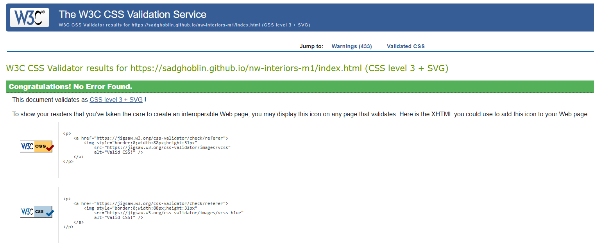
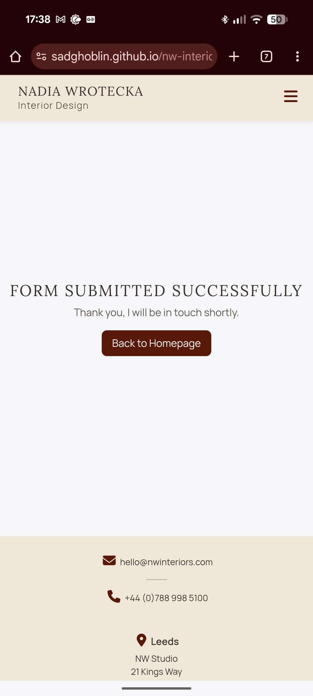
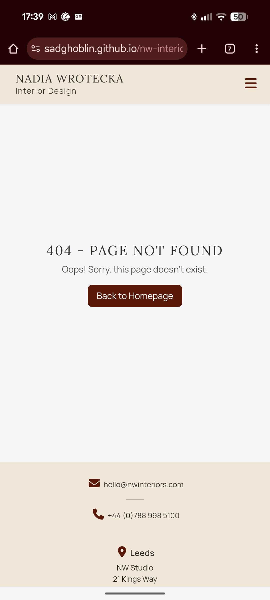

# Testing

> [!NOTE]  
> Return back to the [README.md](README.md) file.

## Code Validation

### HTML

I have used the recommended [HTML W3C Validator](https://validator.w3.org) to validate all of my HTML files.

| Directory | File | URL | Screenshot | Notes |
| --- | --- | --- | --- | --- |
| root | [404.html](https://github.com/SADGHOBLIN/nw-interiors-m1/blob/main/404.html) | [HTML Validator](https://validator.w3.org/nu/?doc=https://sadghoblin.github.io/nw-interiors-m1/404.html) |  | No warnings / errors |
| root | [index.html](https://github.com/SADGHOBLIN/nw-interiors-m1/blob/main/index.html) | [HTML Validator](https://validator.w3.org/nu/?doc=https://sadghoblin.github.io/nw-interiors-m1/index.html) |  | No warnings / errors |
| root | [success.html](https://github.com/SADGHOBLIN/nw-interiors-m1/blob/main/success.html) | [HTML Validator](https://validator.w3.org/nu/?doc=https://sadghoblin.github.io/nw-interiors-m1/success.html) |  | No warnings / errors |

### CSS

I have used the recommended [CSS Jigsaw Validator](https://jigsaw.w3.org/css-validator) to validate all of my CSS files.

| Directory | File | URL | Screenshot | Notes |
| --- | --- | --- | --- | --- |
| assets/css | [styles.css](https://github.com/SADGHOBLIN/nw-interiors-m1/blob/main/assets/css/styles.css) | [CSS Validator](https://jigsaw.w3.org/css-validator/validator?uri=https://sadghoblin.github.io/nw-interiors-m1) |  | No errors, and warnings only relate to external libraries |

### JavaScript

I have used the recommended [JShint Validator](https://jshint.com) to validate all of my JS files.

| Directory | File | URL | Screenshot | Notes |
| --- | --- | --- | --- | --- |
| assets/js | [script.js](https://github.com/SADGHOBLIN/nw-interiors-m1/blob/main/assets/js/script.js) | n/a |  | No warnings / errors |

## Responsiveness

I've tested my deployed project to check for responsiveness issues across mobile, tablet, and desktop.

| Page | Mobile | Tablet | Desktop | Notes |
| --- | --- | --- | --- | --- |
| Home |  |  |  | Works as expected |
| About |  |  |  | Works as expected |
| Portfolio |  |   |   | Works as expected |
| Contact |  |  |  | Works as expected |
| Footer |  |  |  | Works as expected |
| Success |  |  |  | Works as expected |
| 404 |  |  |  | Works as expected |